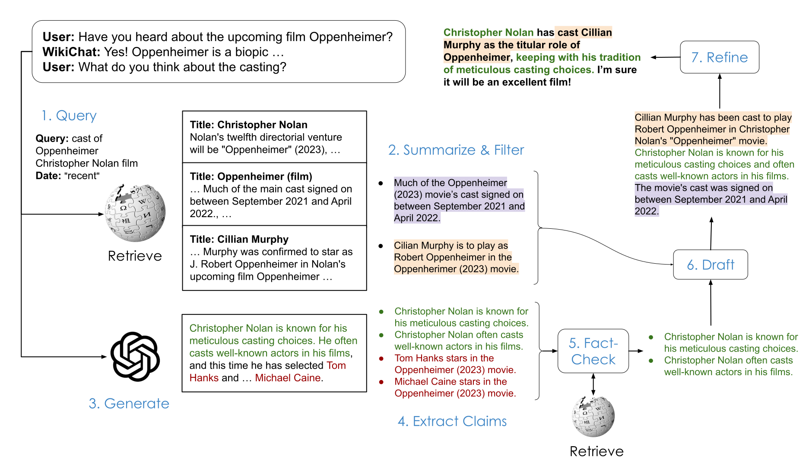

<p align="center">
    
    <h1 align="center">
        <b>WikiChat</b>
        <br>
        <a href="https://arxiv.org/abs/2305.14292">
            
        </a>
        <a href="https://github.com/stanford-oval/WikiChat/stargazers">
            
        </a>
    </h1>
</p>
<p align="center">
    Stopping the Hallucination of Large Language Model Chatbots by Few-Shot Grounding on Wikipedia
</p>
<p align="center">
    <!-- <a href="https://stanford.edu" target="_blank"> -->
        <!--  -->
    <!-- </a> -->
</p>
<p align="center">
    Online demo:
    <a href="https://wikichat.genie.stanford.edu" target="_blank">
        https://wikichat.genie.stanford.edu
    </a>
    <br>
</p>

<!-- <hr /> -->


## Introduction

Large language model (LLM) chatbots like ChatGPT and GPT-4 get things wrong a lot, especially if the information you are looking for is recent ("Tell me about the 2024 Super Bowl.") or about less popular topics ("What are some good movies to watch from [insert your favorite foreign director]?").
WikiChat uses Wikipedia and the following 7-stage pipeline to makes sure its responses are factual.


<p align="center">
    
</p>

Check out our paper for more details:
Sina J. Semnani, Violet Z. Yao*, Heidi C. Zhang*, and Monica S. Lam. 2023. [WikiChat: Stopping the Hallucination of Large Language Model Chatbots by Few-Shot Grounding on Wikipedia](https://arxiv.org/abs/2305.14292). In Findings of the Association for Computational Linguistics: EMNLP 2023, Singapore. Association for Computational Linguistics.

## 🚨 **Announcements** 
- (May 16, 2024) Our follow up paper _"SPAGHETTI: Open-Domain Question Answering from Heterogeneous Data Sources with Retrieval and Semantic Parsing"_ was accepted to the Findings of ACL 2024. Code will be released here soon!
- (January 8, 2024) Distilled LLaMA-2 models are released. You can run these models locally for a cheaper and faster alternative to paid APIs.
- (December 8, 2023) We present our work at EMNLP 2023.
- (October 27, 2023) The camera-ready version of our paper is now available on arXiv.
- (October 06, 2023) Our paper is accepted to the Findings of EMNLP 2023.

## Installation

Everything has been tested using Python 3.8 on Ubuntu 20.04, but should run on other Linux distributions as well.
If you want to use this on Windows or Mac, or with a newer Python version, expect to do some troubleshooting in a few of the installation steps.
We recommend using the conda environment in `conda_env.yaml`.

Clone the repo:
```
git clone https://github.com/stanford-oval/WikiChat.git
cd WikiChat
```

Create and activate the Python environment:

```
conda env create --file conda_env.yml
conda activate wikichat
python -m spacy download en_core_web_sm
```
MMake sure this environment is activated whenever you run any of the following commands.


## Set up the LLM endpoint:

WikiChat is compatible with various LLMs, but we recommend using OpenAI models, via either openai.com or Azure. Additionally, you can use Together.ai, or host your own model locally, but these often result in lower quality outputs.

Fill out the appropriate fields in `llm_config.yaml`.

Then create a file named `API_KEYS` (which is included in `.gitignore`), copy the following into it and fill out the fields for the LLM endpoint you want to use:
```bash
# Fill in the following values with your own keys for the API you are using. Make sure there is not extra space after the key.
# Changes to this file are ignored by git, so that you can safely store your keys here during development.
export AZURE_OPENAI_API_KEY=[Your Azure OpenAI API key from "Keys and Endpoint" section of your deployment]
export OPENAI_API_KEY=[Your OpenAI API key from https://platform.openai.com/api-keys]
export TOGETHER_API_KEY=[Your Together.ai API key from https://api.together.xyz/settings/api-keys]

# Fill in this value if you are using COSMOS DB to store user data via a front end.
export COSMOS_CONNECTION_STRING=[Your COSMOS connection string]
```

## Set up the retrieval index
To retrieve reliable information, WikiChat uses [ColBERT](https://github.com/stanford-futuredata/ColBERT/) to retrieve from a text corpus. You can use our pre-built Wikipedia index, or create your own index using your own data (see [below](#create-your-own-retrieval-index)).
Following most prior work on Wikipedia, we discard tables and lists (including bullet points) when indexing Wikipedia.

Download the English [Wikipedia index](https://huggingface.co/datasets/stanford-oval/wikipedia_colbert_index) from the HuggingFace Hub:

```bash
make download-colbert-index language=en wiki_date=11_06_2023
```

Start a ColBERT inference server that accepts HTTP requests:

```bash
make start-colbert-gunicorn wiki_date=11_06_2023 language=en
```
No GPU is needed to use ColBERT as it is set to use CPU. The entire index will be loaded to RAM, which requires about 100GB of RAM. If you don't have that much RAM, you can enable memory mapping by adding `colbert_memory_map=true` to this command. This will reduce the RAM usage to about 35GB, but will make retrieval slower.

You need to keep this process running so that the chatbot can communicate with the ColBERT index. For that, either keep this terminal open, or use [tmux](https://github.com/tmux/tmux/wiki)/[screen](https://www.gnu.org/software/screen/). By default, the server listens on port 5000. You can test this server by running a curl command like this in a new terminal:
```bash
curl http://127.0.0.1:5000/search -d '{"query": "who is the current monarch of the united kingdom?", "evi_num": 1}' -X GET -H 'Content-Type: application/json'
```

## Interactive Chat via Command Line

You can run different versions of the WikiChat pipeline. Here are a few configurations:

```bash
make demo pipeline=early_combine do_refine=true engine=gpt-4 # the WikiChat_G4 pipeline from the paper
make demo pipeline=early_combine do_refine=true engine=text-davinci-003 # the WikiChat_G3.5 pipeline from the paper
make demo pipeline=early_combine do_refine=false engine=local # the WikiChat_L pipeline from the paper, when used in conjunction with our distilled LLaMA-7B model
make demo pipeline=generate do_refine=false engine=... # the baseline, only LLM generation (Stage 3 of the pipeline)
make demo pipeline=generate_and_correct do_refine=false engine=... # only fact-check the LLM's output (Stages 3, 4, 5, 6 of the pipeline)
make demo pipeline=retrieve_and_generate do_refine=false engine=... # Stages 1, 2, 6 of the pipeline
make demo pipeline=retrieve_only do_refine=false engine=... # Stage 1 of the pipeline

make demo pipeline=early_combine do_refine=true engine=gpt-35-turbo-instruct # a faster version of WikiChat (not in the paper)
make demo pipeline=early_combine do_refine=false engine=gpt-35-turbo-instruct draft_engine=gpt-4 # a balanced version of WikiChat, hallucinates less than the full gpt-35-turbo-instruct version, and has about the same latency (not in the paper)
```

`engine` can be any value on the left hand side of an `engine_map` in `llm_config.yaml`.

See pipelines/pipeline_arguements.py for more details on the different pipeline configurations.


## Run a distilled model for lower latency and cost
First, make sure to set the `api_base` field in `llm_config.yaml`, and note the `ip` address and `port` number.

Then start the inference server in a separate terminal using [HuggingFace's text-generation-inference library](https://github.com/huggingface/text-generation-inference/).
We recommend using their provided Docker image given its ease of use. Download one of the available models, then run `docker run --gpus all --shm-size 1g -p <port>:80 -v ./:/data ghcr.io/huggingface/text-generation-inference:1.3.4 --model-id /data/<path-to-model-directory> --hostname <ip> --num-shard <number-of-gpus>`.
When the inference server is running on an NVIDIA A100 GPU, each chatbot response should take just a few seconds, plus the time needed for retrieval via ColBERT.

The following models are available on the HuggingFace Hub.

- [stanford-oval/Llama-2-7b-WikiChat](https://huggingface.co/stanford-oval/Llama-2-7b-WikiChat): A slightly improved version of the distilled LLaMA model described in our paper. Similar to the paper, stages 6 (draft) and 7 (refine) are fused together. The differences from the paper are:
1. In addition to fine-tuning on simulated conversations about Wikipedia topics, we also include several less knowledge-intensive (i.e. more chit-chat) simulated conversations to prevent failure modes.
1. We fine-tune `LLaMA-2-7B` instead of `LLaMA-7B`.
Run `make demo engine=local do_refine=false` if you are using this model.

- [stanford-oval/Llama-2-7b-WikiChat-fused](https://huggingface.co/stanford-oval/Llama-2-7b-WikiChat-fused): Similar to the previous model, except that stages 3 (generate) and 4 (extract claim) are also fused together. Therefore, this model is almost twice as fast.
Run `make demo engine=local do_refine=false fuse_claim_splitting=true` if you are using this model.


## Run user simulator
In order to evaluate a chatbot, you can simulate conversations with a user simulator. `subset` can be one of `head`, `tail`, or `recent`, corresponding to the three subsets introduced in the paper. This script will read the topic (i.e. a Wikipedia title and article) from the corresponding `benchmark/topics/$(subset)_articles.json.` file. `num_output_dialogs` is the number of simulated dialogs to generate, and `num_output_turns` is the number of turns in each dialog.

```bash
make simulate-users user_engine=gpt-4 user_temperature=1 subset=head num_output_dialogs=1 num_output_turns=2
```
Depending on the engine you are using, this might take some time. The simulated dialogs and the log file will be saved in `benchmark/simulated_dialogs/`.
You can also provide any of the pipeline parameters from above.
You can experiment with different user characteristics by modifying `user_characteristics` in `benchmark/scripts/user_simulator.py`.

## Evaluate factuality and conversationality of any conversation
Coming soon!

## Interactive Chat via a Web Interface

You can try out our online demo at wikichat.genie.stanford.edu, or host your own.
The following code requires [Cosmos DB](https://azure.microsoft.com/en-us/products/cosmos-db) (Azure's offering of MongoDB) to store user data, but you can easily modify it to use a different database.

Bring up the backend API:

```bash
make start-backend-gunicorn do_refine=true ssl_key_file=/path/to/privkey.pem ssl_certificate_file=/path/to/fullchain.pem
```

This script requires generating an SSL certificate. You can use a self-signed certificate for development or disable SSL by modifying the code.
However, for production and if you are hosting the frontend and backend on separate machines, you should use a valid certificate. Otherwise, user inputs are transferred from the frontend to the backend API unencrypted. You can obtain a free certificate from [Let's Encrypt](https://letsencrypt.org/).

Note that `engine` and `pipeline` are not important here, as the frontend will send the appropriate parameters to the backend.
This brings up a gunicorn server (on port 5001) and a Redis server (on port 5003) to persis Flask's rate limit data to disk.
To shut down the gunicorn server, simply press `ctrl + c`.
To shut down the Redis server, run `redis-cli -p 5003 shutdown`.

Run this `curl` command to test the backend:

```bash
curl http://127.0.0.1:5001/chat -d '{"experiment_id": "test_experiment", "dialog_id": "test_dialog", "turn_id": 0, "system_name": "early_combine", "new_user_utterance": "Who stars in the wandering earth 2?"}' -X POST -H 'Content-Type: application/json'
```

The frontend is located at https://github.com/stanford-oval/ovalchat, which you can deploy separately on another VM or via vercel.com. Follow the instructions there to set up the frontend.


## Create your own retrieval index
You can change the default values of the following parameters in `Makefile` if needed:

```bash
nbits ?= 1# encode each dimension with 2 bits
max_block_words ?= 100# maximum number of words in each paragraph
doc_maxlen ?= 140# number of "tokens", to account for (100 "words" + title) that we include in each wikipedia paragraph
wiki_date ?= 11_06_2023# The date on which the Wikipedia dump was downloaded
language ?= en# the English Wikipedia
nranks ?= 8# number of GPUs to use for indexing
```

If you are supplying your own data, make sure you have a file named `collection_all.tsv` with the format `id \t title | passage` in each line, then skip to `make index-wiki` below.

Download latest English wikipedia dump:
```bash
make download-latest-wiki
```

Run wikiextractor:
```bash
make extract-wiki
```
This will extract the pages into a set of sharded files, which will be located in the `text/` directory. This step takes a few hours. 

Run
```bash
make split-wiki
```
This script will split the Wikipedia documents into blocks, with each block containing up to `max_block_words` words. It will write these blocks into `collection_all.tsv` which is then used for making the ColBERT index.

Run this command to start ColBERT indexing. This step should be run on GPUs:

```bash
make index-wiki
```

Optionally, you can merge all the smaller index files into a single file. This will enable you to use mempory mapping when loading the index, which will reduce the RAM usage at the cost of increasing the retrieval speed. This step requires enough RAM to load the entire index, about 100GB of RAM, but after that, the resulting index can be run on a machine with as little as 35GB of RAM.
```bash
make coalesce-index
```

## Citation

If you have used code or data from this repository, please cite this paper:

```bibtex
@inproceedings{semnani-etal-2023-wikichat,
    title = "{W}iki{C}hat: Stopping the Hallucination of Large Language Model Chatbots by Few-Shot Grounding on {W}ikipedia",
    author = "Semnani, Sina  and
      Yao, Violet  and
      Zhang, Heidi  and
      Lam, Monica",
    editor = "Bouamor, Houda  and
      Pino, Juan  and
      Bali, Kalika",
    booktitle = "Findings of the Association for Computational Linguistics: EMNLP 2023",
    month = dec,
    year = "2023",
    address = "Singapore",
    publisher = "Association for Computational Linguistics",
    url = "https://aclanthology.org/2023.findings-emnlp.157",
    pages = "2387--2413",
}

```

This repository also contains code from https://github.com/attardi/wikiextractor for preprocessing Wikipedia, and https://github.com/stanford-futuredata/ColBERT/ for ColBERT. If you use code from these repositories, please cite their respective repository and paper as well.
